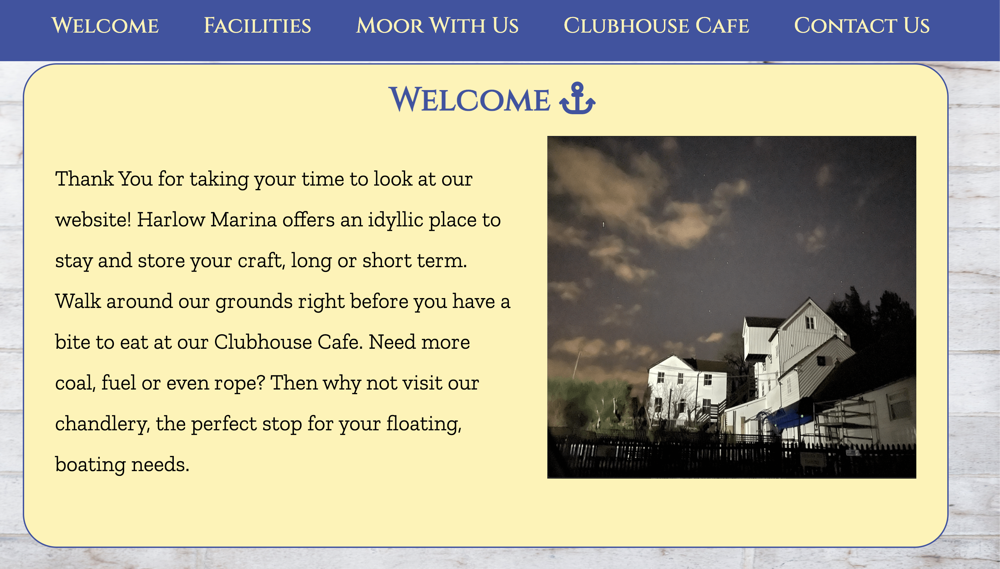
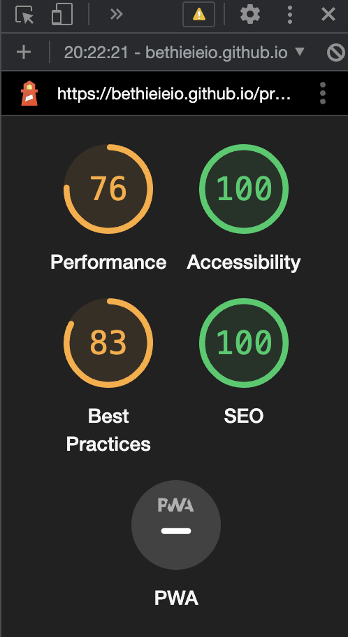
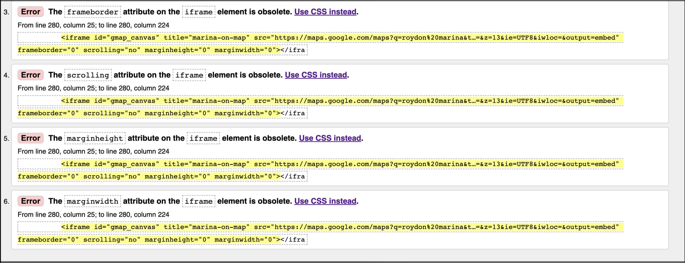
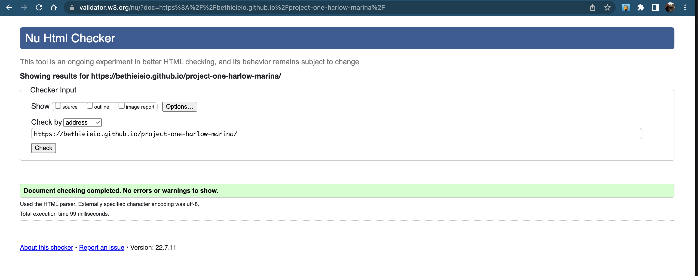
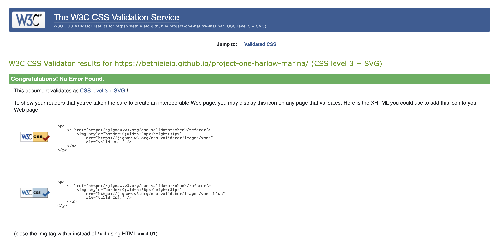

# Harlow Marina - a community and boat moorings

## Introduction 
Harlow Marina website was created by Beth Allaway. 
Harlow Marina is a site for infomation about a marina that stores craft on inland waters.
It advertises the facilites, mooring fees, offers at the cafe and how to contact them.
The site is aimed at people who are looking to store their boat and people who are new to boating.

## Table of Contents

## Planning Stage
### Target Audience
- Users who already have a boat and want to store it in a marina.
- Users who want to find the latest offers at the sites cafe.
- Users who want to contact the marina team.
- Users who are new to boating and want to find more about inland water life.

### User Stories
- As a user I want to find where the marina is located.
- As a user I want to be able to call the marina.
- As a user I want to see a list of facilities at the marin.
- As a user I want to be able to see what is for sale at the cafe.
- As a user I want to be able to sign up to the mailing list.
- As a user I want to be able to find the marina's social pages.

### Site Aims
- To educate users about the marina.
- To make the user up to date with cafe offers.
- To easily communicate with users for any queries they have.
- To advertise the facilities the marina to show them the site is a one stop location for boating needs.
- To show the current up to date mooring fees.

### Colour Schemes
- I used [Coolors](https://coolors.co) to help me choose the above colours of #FFF3B0 yellow and #3c54a3 blue.
They are colours that represent the sun and water respectively and both colours stand out and are easy to see as text when the other colour is its background partner. I also used black and white as black can be seen with the yellow background and white to give the site cleaniness and a light airy feel (background).

### Typeography 
- [Google-Fonts](https://fonts.google.com/) is what used to pick the three types of font I have on the website.
- Cinzel used in headings and the nav bar. It is a bold stand out presence with its all caps look.
- Yellowtail is only used for the motto. I just really like it, very flowy that matches what the motto means.
- Zilla Slab used in all other text. Very simple and easy to read. It matches the heading font perfectly.

## Page Content 
### Hero Image, Logo and Slogan
- A hero image is an oversized banner at the top of the website.
- The site has one of a photograph at the marina down one of the pontoons.
- It gives a sense of where the users boat will be if they choose to moor their boat at the marina.
- The image has a white opacity of 0.5 to make the logo and slogan readable inside the image.

- The logo is the marinas name "Harlow Marina" it is in the Cinzel font.
- It is in the normal blue font and has the normal yellow shadow, making it stand out to the text in the same font.
- It is located in large font in the middle of the hero image, making it the first words the users would read on the site.

- The slogan is located underneath the logo. 
- It is the only text in the YellowTail font and is a solid black colour.
- "Modern Mooring and Making Memories". The use of alliteration makes the company easy to remember and what they do.

### Navigation Bar
(Picture in above paragraph)
- The Navigation bar takes the user to all the main sections to the website.
- It has the blue background and the yellow text in the Cinzel font.
- When the user hovers over one of its links, a yellow line appears underneath the word to show it is a link.
- When the user is at the very top of the page, the nav bar is located just below the hero image.
- When the user scrolls down the page or uses the links in the nav bar, it then sticks to the top of the page.
- When the user scrolls back to the top, it goes backk to its original place.

### Sections
- Each sections are divided in the yellow boxes with the blue border. 
- The main text colour is mostly black, so break up the blue and yellow.
- The colours stand out from eachother and make it easy to read.
- They each have an icon in the title for visual context.
- The title font is in Cinzel, and the main text is in Zilla Slab.

### The Welcome Section
- The title icon is an anchor.
- The welcome section welcome the user to the site. 
- It thanks the customer for visiting and explaining in a nutshell what the marina is for.
- The image in the section is one of the marina buildings at night.

### The Facilities Section
- The title icon is a shop.
- It gives a brief description of when the marina was first established.
- Tells the user how many spaces it has.
- Explaion which part of the river the  marina is and where it leads to.
- The list of facilities is in a blue box with yellow writing to stand out from the description.

### The Moor With Us Section
- The title icon is a boat.
- It has four columns Boat Size, Annual Payment, Quarterly Payment and Monthly Payment.
- The headings are the reverse colours of the data so they stand out more to make the table easier to understand.
- The user finds their boat length, then moves horizontal to see the price of mooring for that size.
- At the bottom there is an extra cost if an end jetty is required. 

### Clubhouse Cafe Section
- The title icon is a coffee mug.
- The four images show the lastest offers at the cafe
- The images have a black 0.4 opacity to make the writing more visible against the bright colours of the food.

### Contact Us Section
- The title icon is a phone.
- On the left hand side there is a form to email the marina
- The customer inputs their name, email address, which deparment the question is for and the message.
- All the form has to be filled in for it to be sent.
- When the customer sends the form, another page opens to say that their enquiry as been sent.
- The background of the form is the same as the overall background to the webiste, so apprears to be see through.
- The success page has a green tick icon.
- In the right there is a google map to show the location.
- Below, there is a phone number for the site.
- If the user hovers over the phone number picture, another picture will be visible.

### Footer
- The footer's main colour is the blue with yellow text.
- It has a mailing list for users who wish to keep up to date with news. When the users email has been submitted, the success page appears.
- There is an up arrow icon, once clicked, it sends the user back to the very top of the site.
- The footer also includes four links to the marinas social network pages (Facebook, Youtube, Twitter and Instagram.) Once these are clicked, they open a new tab.

## Future Enhancements
- I would love to add a gallery section to the site, that would include the buildings, the boats and the people. It would give more of an idea of what the marina is like. Maybe even include a site map too.
- As well as the cafe offers, adding the main menu would be very useful so the users can see what food there is avaliable before coming down to visit.
- An events / news page would be valuable. The section would keep current users at the marina up to date with news while potential users can come down for the first time at an event to see the sites.

## Testing

### Lighthouse
I used [Lighthouse](https://chrome.google.com/webstore/detail/lighthouse/blipmdconlkpinefehnmjammfjpmpbjk?hl=en), the Google chrome tool to test the website. The results are below.

### W3C HTML Validator
I used [W3C's](https://validator.w3.org/) HTML validator to test the HTML on the website. Only after fixing a couple of simple errors.
- I removed obsolete attributes in the embedded map iframe.
- I changed the spans to help with navigation into divs as its best practice to not has the spans here, as they had 'h2' headings inside the tags.

 I tested again to see that there are no more errors in the HTML.

### W3C CSS Validator
I used [W3C](https://jigsaw.w3.org/css-validator/) again, this time for its CSS validator. After only testing it once, I found that there were no errors in the websites CSS.

### Manual Testing
- I tested the website on Chrome, Safari and Edge.
- The website loaded at a suitable rate, all the images appearing at the same time.
#### Navigation Bar
- The hovers on the nav bar all worked as normal with no delay.
- All the nav links took the user to the correct part of the page.
- The smooth scroll behavior worked on all sites, although it appeared faster in Safari.
#### Contact Us
- The cat picture in "Contact Us" hover workd as it should.
- The map showing the marinas location works, zooming the page map in and out or to scroll around the map.
- Typing in the forms as no issues, the form selection also works with no issues.
- The required message that appears if any of the fields have not been filled out are present.
- Pressing send on the form takes the user to the the success page. It does not lag when it loads.
#### Footer
- The "to the top of the page" button in the footer worked,
- All the social media links in the footer took the user to the correct sites.
- The mailing list 'Sign Up' button successfuly takes the user to the success page.
- The user is shown a 'required' message if they fail to add an email to the email field. It does not lag when it loads.

## Bugs

- Issue: Slow loading picture
- Cause: The Welcome image was too large
- Resolution: I made it smaller

- Issue: I had to scroll sideways for the Moor With Us table for a mobile
- Cause: The table is large
- Resolution: Removed a column

- Issue: I could scroll sideways on my mobile size
- Cause: The mailing list button was overflowing
- Resolution: Relocated it underneath email box

## Deployment
I deployed my site my doing the following:-
- Going into my repositopry on Gtihub.
- Clicking the repository's settings.
- On the left hand side, there is a menu item called 'Pages'
- I made sure the Branch was on 'Main'
- I gave the title 'project-one-harlow-marina' and clicked 'Save'
- I clicked the link to make sure it worked.
- I then copied the link and added it to the about section in my repository.
- You can find the live site here. https://bethieieio.github.io/project-one-harlow-marina/

## Technology
I used the following technology 
- HTML5
- CSS3
- JavaScript
- [Font Awesome](https://fontawesome.com/) - for title icons
- [Google Fonts](https://fonts.google.com/) - for the font
- [Google-Map-Generator](https://google-map-generator.com/) - the map in contact section
- [Cat Ipsum](http://www.catipsum.com/) - used to bulk out sections before the final text was addded.
- [GitHub](https://github.com) - for keeping my work safe and deploying it.

## Credits
- [w3schools](https://www.w3schools.com/howto/howto_css_hero_image.asp) The hero image was thanks to this link at w3schools.
- [w3schools](https://www.w3schools.com/howto/howto_js_navbar_sticky.asp) They also helped me create the sticky nav with this link.
- [codepen](https://codepen.io/cferdinandi/pen/GRJvozN) To allow the title to be seen with the sticky nav, Code Pen helped me out.
- [Flex Box Froggy](https://flexboxfroggy.com/) Helped me understand more about Flex.
- [Developer.Mozilla](https://developer.mozilla.org/en-US/docs/Web/HTML/Element/select) Helped me include the select option in the contact page
-  [Google Map Generator](https://google-map-generator.com/) used the code here to create the map for the location.

## Honourable Mentions
- My partner [Ashleigh](https://github.com/bashleigh) For being my tech support, my rock and my cheerleader.
she also wrote the javascript to close the hamburger when the user clicks the link.
- My Mentor Richard for the calls, the confidence and the courage.

## Content
- I used the code from the [Love Running Project](https://bethieieio.github.io/love-running/) for the social medoa links in the footer.

## Media 
Images of boats, cats and buildings are my own.
The only images that are not my own are the images in the Clubhouse Cafe Section, they were all from [Flickr](https://www.flickr.com/).
- [Cream Tea](https://www.flickr.com/photos/50094405@N04/9738024264/sizes/n/)
- [Soup](https://www.flickr.com/photos/browneyedbaker/6778039224/sizes/n/)
- [Cake](https://www.flickr.com/photos/21607251@N05/7177667775/sizes/n/)
- [Steak](https://www.flickr.com/photos/sweetladysweets/5125935424/sizes/n/)

